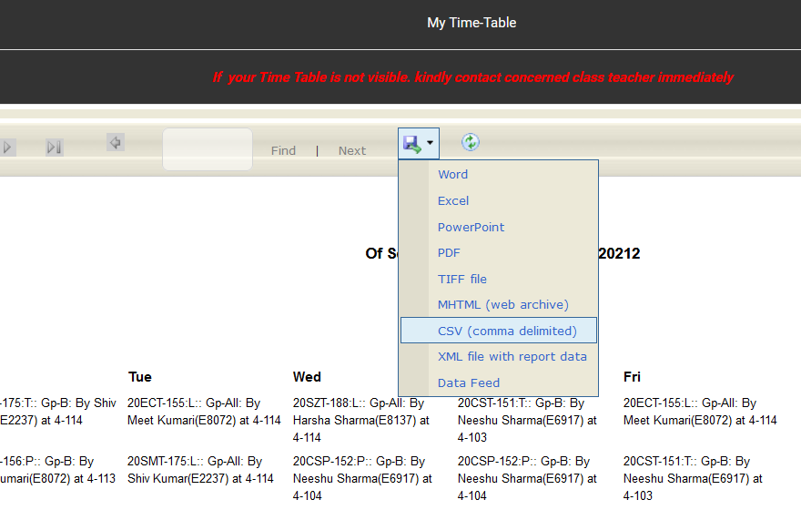
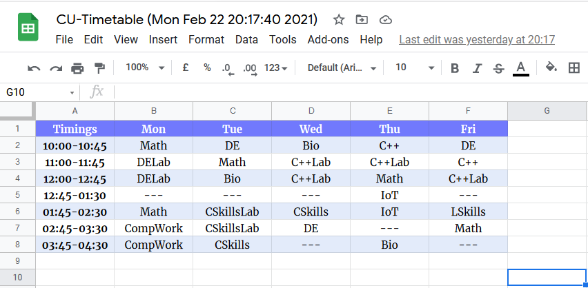

========
Tutorial
========

This tutorial walks you through the process of creating your very first
timetable using ``cutt``.

Step 1: Download the CSV timetable
==================================
Login to your account on the university's website. Then, navigate to the
timetable panel and download the CSV file from the dropdown as show below:

Step 2: Create a *courseinfo file*
==================================
A *courseinfo file* is a JSON file that contains a mapping of the course
codes to course names. It is required.

Use the following command to create it (replace ``path/to/timetable.csv``
with the path to the file you downloaded in step 1):
::

	python -m cutt courseinfo -i path/to/timetable.csv

This will interactively prompt you to enter alternative names for the courses.
Enter some short names, the ones you prefer. Here's an example interaction:
::

	$ python -m cutt courseinfo -i path/to/timetable.csv
	Enter alternative names for courses as prompted.
	If no alternative name is given, the default name is kept.
	Recommendation: Keep names shorter than 11 characters.

	Alternative name for "Biology for Engineers" = Bio
	Alternative name for "Calculus and Vector Spaces" = Math
	...

Step 3: Create the timetable
============================
Finally, create your timetable. There are multiple types of output you can
get.

Output a CSV file
-----------------
This is the easiest to do. Just run the following command:
::

	python -m cutt csv path/to/timetable.csv path/to/output.csv

It will create a CSV file which has the timetable in a much compact form. You
can then open it in your spreadsheet application, format it to your wish, and
take a picture of it. Or you can do something else.

Create a Google Sheet
---------------------
For this, you'll need a Google Sheets API credentials file. Download it from
`here <https://developers.google.com/sheets/api/quickstart/python>`_ and place
it in your project directory with the name ``credentials.json``.

Then, run the following command:
::

	python -m cutt gsheet path/to/timetable.csv

You'll be asked to login to your Google account (if you aren't logged in
already) and give some permissions to the program. After you do all that,
you'll have a new Google Sheet in your Google Drive. That is your timetable.

