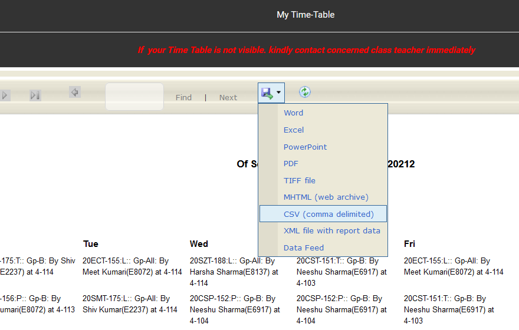

# CU-Timetable
A simple script to prettify (and make readable) my university's overwhelmingly info-dense timetables.

## The Problem
The timetables provided on CUIMS (university's website) are quite cryptic. They look like this:
<p align="center"></p>

See! You don't even get course names--you are given course IDs instead. You then have to find the course
name from the table at the bottom of the pic. Of course, one quickly learns to recognise courses by the teacher's name,
but it still is inconvenient.

## The Solution
Basically, using this script, you can convert the original timetable to a Google Sheet:
<p align="center"></p>

Then you can take a screenshot of and crop it to finally get this:
<p align="center"></p>

Which is more accessible than the original--which is good. Sweet!

## How to run?
Before running you'll need the following:
 1. Python 3.
 2. The latest CSV timetable file from the "My Time Table" panel on CUIMS, as shown below:
    <p></p>
 3. A Google Sheets API credentials file (`credentials.json`) which you can download from here: https://developers.google.com/sheets/api/quickstart/python
 4. Some libraries which you can install by executing the following on your command line:
    ```
    pip install --upgrade google-api-python-client google-auth-httplib2 google-auth-oauthlib
    ```
 5. A `coursenames.json` file containing a map of course IDs to the course names you want to be shown on the timetable.

After you have all that, just run the script. Your browser window will open and you'll be asked to:
 1. Login to your Google Account (if you aren't logged in already).
 2. Give permissions to the script to read and write spreadsheets to your Google Drive.

After a successful run, you should have a new spreadsheet in your Google Drive. That's your timetable!

## May not work if...
If the structure of the CSV file on CUIMS changes, this program may not work. I am counting on CUIMS'
devs here--since they have cared enough to provide a CSV timetable, they will, hopefully, keep the
structure unchanged.

## Pending work
This is not yet complete. For a list of pending work see [issues](https://github.com/palak-jha/CU-Timetable/issues).

## Obligatory meme
<p align="center"></p>
