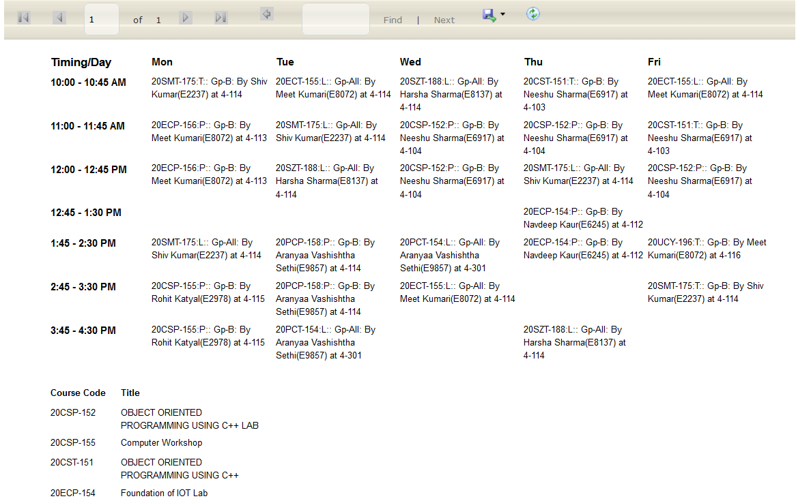
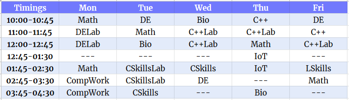

========
``cutt``
========
**C**\ handigarh **U**\ niversity **T**\ ime\ **T**\ able (``cutt``) is a
command line script that generates readable timetables for the students of
Chandigarh University.

The Problem: Timetable, why you hate me?
========================================
The timetables provided on the university's website are hard to read:

Quick question: Where do you see the course names *in the timetable*?

That's right, course names are nowhere to be seen in the timetable proper. You
are given instead the course codes. You then have to find the corresponding
course names from the table at the bottom. Ah, how convenient!

The Solution: ``cutt`` saves the day!
=====================================
Enter ``cutt``. It solves the problem by converting the unreadable timetables
to something like this sweet baby:

Awww, look how readable... and pretty! Koochee koochee koo...

Now, you can tell at a glance which classes you have to attend for the day.
Yay!

Documentation
=============
There are a few other things you can do. See ``Documentation/`` for usage
instructions and more.
